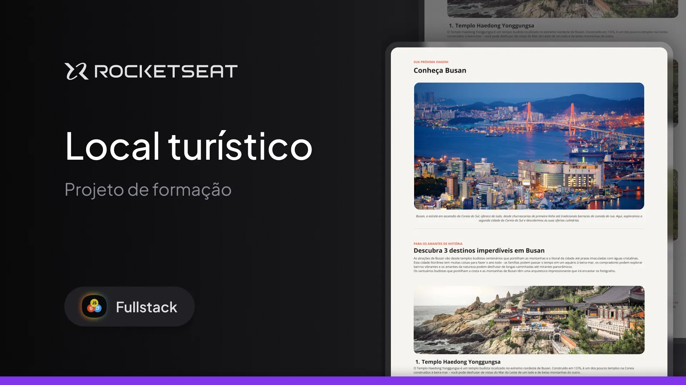

<h1 align="center"> Challenge - Tourist Spot</h1>

This project was a challenge from Rocketseat's Fullstack course aimed at learning and applying the following HTML and CSS concepts:

- HTML structure;
- CSS styling;
- Fonts;
- Spacing;
- Images;
- Unordered lists;
- Text color changes;
- Text weight changes.

The website showcases 3 tourist spots with important information for the reader.

  <a href="#-technologies">Technologies</a>&nbsp;&nbsp;&nbsp;|&nbsp;&nbsp;&nbsp;
  <a href="#-project">Project</a>&nbsp;&nbsp;&nbsp;|&nbsp;&nbsp;&nbsp;
  <a href="#-layout">Layout</a>&nbsp;&nbsp;&nbsp;|&nbsp;&nbsp;&nbsp;
  <a href="#memo-license">License</a>

  

 

  

## 🚀 Technologies

This project was developed using the following technologies:

- HTML and CSS
- Git and GitHub
- Figma

## 💻 Project

Tourist Spot is a website that presents three tourist locations with relevant information.

- [Access the finished project online](https://dev-filipebcs.github.io/tourist-place/)

## 🔖 Layout

You can view the project layout through [THIS LINK](https://efficient-sloth-d85.notion.site/Desafio-pr-tico-Local-Tur-stico-c703fe13a3d44f3687277f424ffad157). You need a [Figma](https://figma.com) account to access it.

## :memo: License

This project is under the MIT license.
